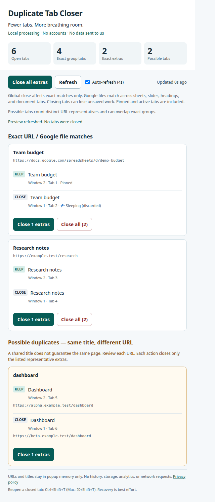

# Duplicate Tab Closer

Struggling to keep up with your 400+ open Chrome tabs? Worried that many are duplicates, using up your laptop's RAM or slowing things down?

**Close duplicate tabs across your Chrome windows. Runs entirely in your browser. No accounts, analytics, ads, or data sent to us. Free and open source.** Closing unnecessary tabs can free resources; the effect varies with page activity and Chrome's memory saver.



## Install locally

1. Download this repository or a release ZIP and extract it.
2. Open `chrome://extensions` in Chrome and turn on **Developer mode**.
3. Choose **Load unpacked** and select the folder containing `manifest.json`.
4. Pin Duplicate Tab Closer using Chrome's Extensions menu, then click its icon.

Chrome Web Store publication is pending; no store installation link is available yet. This source release is a candidate for store submission until the manual checklist in [VALIDATION.md](VALIDATION.md) is completed.

## How it works

- Reads accessible tabs across windows in the current Chrome profile. Other profiles, other devices, and incognito tabs are outside its scope.
- Exact matching preserves full URLs, including query strings and fragments, except recognized Google Docs, Sheets, Slides, and Forms file paths. Those match by file ID across headings, document tabs, sheets, and slides. Published Forms URLs remain distinct.
- Keeps the **lowest tab ID**, marking remaining members as extras. This usually reflects opening order, but Chrome exposes no reliable creation timestamp; restored tabs may differ. Pinned and active tabs receive the same rule and are labeled in the preview.
- Includes memory-saver/discarded tabs with a sleeping indicator and uses pending URLs when a current URL is unavailable.
- Skips chrome:, chrome-extension:, devtools:, about:, data:, and edge: URLs, plus unavailable or invalid URLs.
- Possible duplicates group one representative per distinct matching key by trimmed, lowercased title. A shared title can refer to different pages. Their amber controls require confirmation and close only the listed representatives, leaving any other exact copies for exact-group actions.

**Close all extras** affects exact groups only. Each exact group also has **Close N extras** and a confirmed **Close all (N)** action that includes its KEEP tab. Preview refresh never closes tabs automatically. Auto-refresh runs every four seconds only while the popup is open; disabling it lasts for that popup session.

Statistics count all accessible open tabs, members of exact groups, exact extras, and possible representative tabs. Possible counts can overlap exact groups; do not sum these counts.

## Before closing tabs

Closing tabs can lose unsaved edits or forms. This extension does not inspect page contents or protect unsaved work. Different Google file views are deliberately merged. Review the preview, especially pinned, active, and same-title tabs. The extension rechecks preview membership and URLs before closing and aborts changed groups. Browser navigation can still race a close operation.

Chrome's **Ctrl+Shift+T** (Mac: **⌘+Shift+T**) can reopen recently closed tabs as best-effort recovery. There is no extension Undo feature.

## Privacy and permissions

Only `tabs` is requested to read open-tab URLs and titles for matching. Tab information is processed locally in popup memory and never transmitted or persistently retained by the extension. No host permissions, content scripts, background worker, remote code, external assets, analytics, storage, or account are used. The manifest prohibits network connections from extension pages.

Read the [privacy policy](docs/privacy.html). Chrome, the store, and GitHub operate under their own policies. Use synthetic/redacted data in support reports.

## Development and releases

No build step or runtime dependencies. Run focused tests with Node.js 24:

```sh
node --test tests/*.test.js
node --check popup.js
python3 scripts/package.py
```

The Python standard-library packaging script creates a deterministic ZIP and SHA-256 file in `dist/`. Only runtime files, local privacy policy, icons, LICENSE, and NOTICE are packaged. `scripts/artwork.py` optionally regenerates the original geometric artwork with Pillow; Pillow is not needed to run or package the extension.

[CONTRIBUTING.md](CONTRIBUTING.md) explains contribution requirements. [RELEASE.md](RELEASE.md) describes publication and updating. The source is licensed under [Apache 2.0](LICENSE), including an explicit contributor patent grant under that license's terms.

## Support

File a [GitHub issue](https://github.com/ssrselvamraju/chrome-duplicate-tab-closer/issues) using redacted or synthetic examples. For vulnerabilities, follow [SECURITY.md](SECURITY.md). The maintainer does not receive browsing information automatically.
